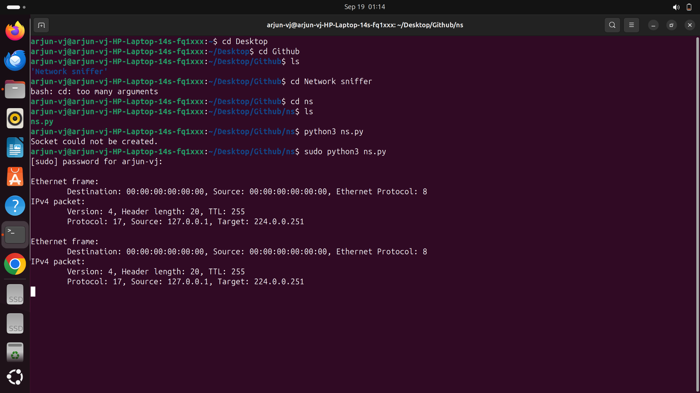
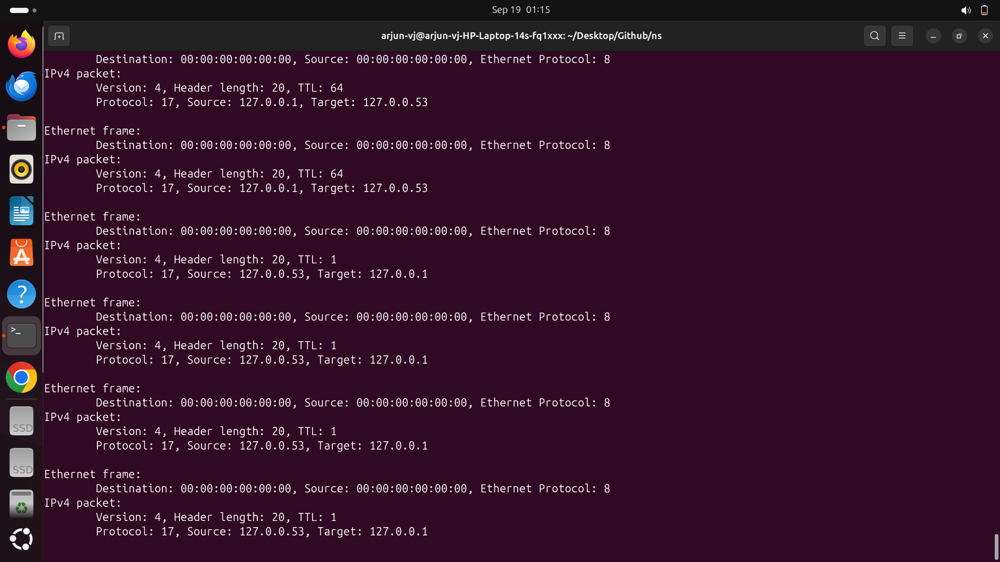

# Basic Network Sniffer

This project is a basic implementation of a network sniffer using Python. It captures incoming Ethernet frames and IPv4 packets, displaying essential information such as MAC addresses, protocol types, and IP addresses.
## Demo




## Table of Contents
- [Installation](#installation)
- [Usage](#usage)
- [Features](#features)
- [How it Works](#how-it-works)

## Installation

1. **Prerequisites**: 
    - Python 3.x
    - Administrator/root access to run the script, as raw sockets require elevated permissions.

2. **Setup**:
   - Clone the repository or download the script:
     ```bash
     git clone https://github.com/yourusername/network-sniffer.git
     ```
   - Navigate to the directory:
     ```bash
     cd network-sniffer
     ```

3. **Run the script**:
   - You may need to run the script with elevated privileges to use raw sockets:
     ```bash
     sudo python3 network_sniffer.py
     ```

## Usage

- The script listens for incoming Ethernet frames and prints information such as MAC addresses, Ethernet protocol, and IPv4 packet details.
- To start sniffing, simply run the script as mentioned above. It will run in an infinite loop and output packet details as they are captured.

### Thank you


