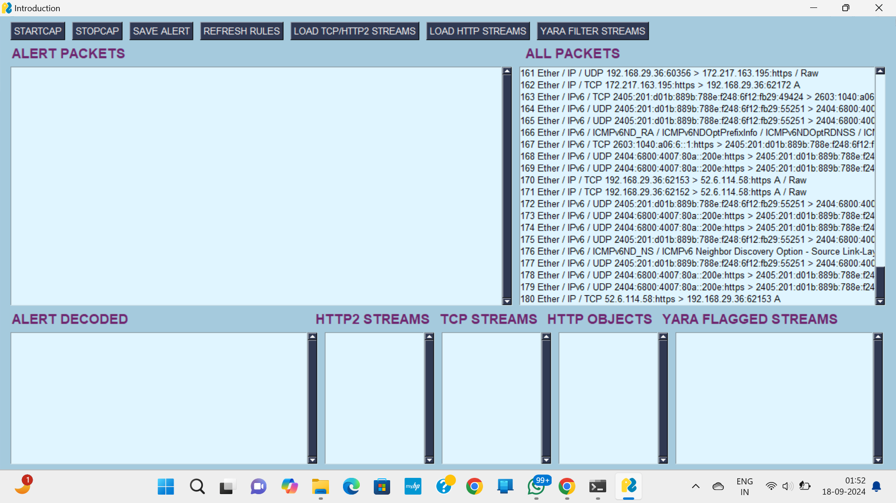

# Network Intrusion Detection System (NIDS) Using Snort

This project demonstrates how to set up a Network Intrusion Detection System (NIDS) using Snort, an open-source network intrusion detection system capable of real-time traffic analysis and packet logging.
## Example Output

Here is an example of Snort’s output:




## Table of Contents

1. [Requirements](#requirements)
2. [Installation](#installation)
3. [Configuration](#configuration)
4. [Usage](#usage)
5. [Troubleshooting](#troubleshooting)

## Requirements

Before you begin, ensure you have met the following requirements:

- **Operating System**: Windows or Linux (Ubuntu/Debian recommended)
- **Hardware**: Minimum 1GB RAM, 1GHz CPU
- **Software**:
  - Snort (latest version)
  - libpcap (for packet capture)
  - DAQ (Data Acquisition library)
  - Support libraries (e.g., pcre, libdnet)

## Installation

### On Linux (Ubuntu/Debian)

1. **Update the package index**:
    ```bash
    sudo apt update
    ```

2. **Install required dependencies**:
    ```bash
    sudo apt install -y build-essential autoconf libtool flex bison
    sudo apt install -y libpcap-dev libpcre3-dev libdumbnet-dev
    ```

3. **Download and install DAQ**:
    ```bash
    wget https://www.snort.org/downloads/snort/daq-2.0.7.tar.gz
    tar -xvf daq-2.0.7.tar.gz
    cd daq-2.0.7
    ./configure
    make
    sudo make install
    ```

4. **Download and install Snort**:
    ```bash
    wget https://www.snort.org/downloads/snort/snort-2.9.18.tar.gz
    tar -xvf snort-2.9.18.tar.gz
    cd snort-2.9.18
    ./configure --enable-sourcefire
    make
    sudo make install
    ```

5. **Create Snort user and directories**:
    ```bash
    sudo groupadd snort
    sudo useradd snort -r -s /sbin/nologin -g snort
    sudo mkdir /etc/snort
    sudo mkdir /var/log/snort
    sudo chown snort:snort /etc/snort
    sudo chown snort:snort /var/log/snort
    ```

### On Windows

1. **Download Snort** from the [Snort website](https://snort.org/downloads) and follow the installation instructions provided in the Snort documentation.

2. **Install required dependencies** as needed, following the instructions in the Snort Windows installation guide.

## Configuration

1. **Configure Snort** by editing the `snort.conf` file located in `/etc/snort` on Linux or the Snort installation directory on Windows.

   Example configuration settings:
    ```bash
    ipvar HOME_NET 192.168.1.0/24
    ipvar EXTERNAL_NET any
    portvar SHELLCODE_PORTS [ 137,138,139,445 ]
    ```

2. **Update Snort rules** by downloading the latest rule sets from the Snort website or other sources.

   Example command to update rules:
    ```bash
    sudo wget https://www.snort.org/rules/snortrules-snapshot-29180.tar.gz -O /etc/snort/rules.tar.gz
    cd /etc/snort
    sudo tar -xvf rules.tar.gz
    ```

## Usage

1. **Run Snort in IDS mode**:
    ```bash
    sudo snort -A console -c /etc/snort/snort.conf -i eth0
    ```

2. **Check the logs** in `/var/log/snort` for detected intrusions.

## Troubleshooting

- Ensure all dependencies are correctly installed and paths in `snort.conf` are correctly set.
- Verify network interfaces and IP configurations.
- Review Snort logs and output for errors and warnings.

---

For detailed Snort documentation and advanced configuration options, refer to the [Snort User Manual](https://snort.org/documents).

### Thank you.

